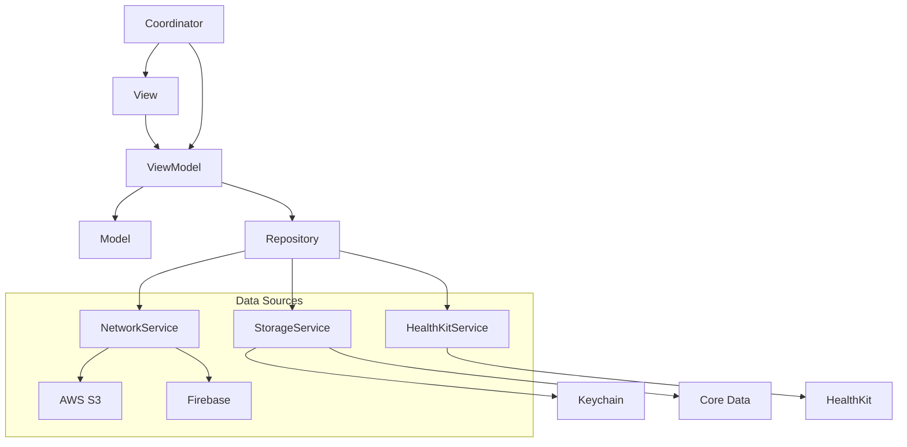
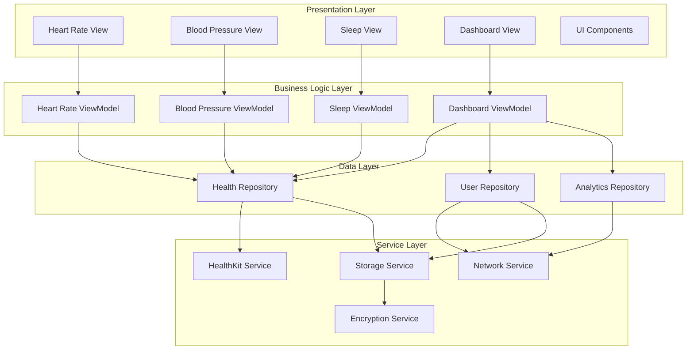
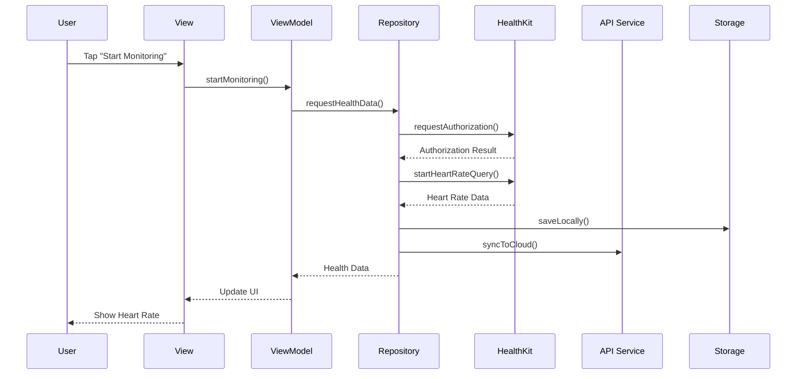
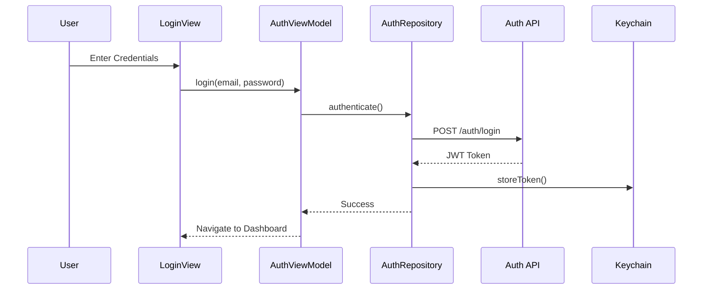
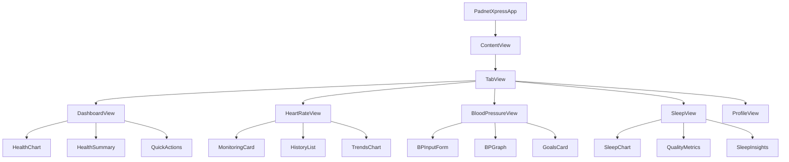
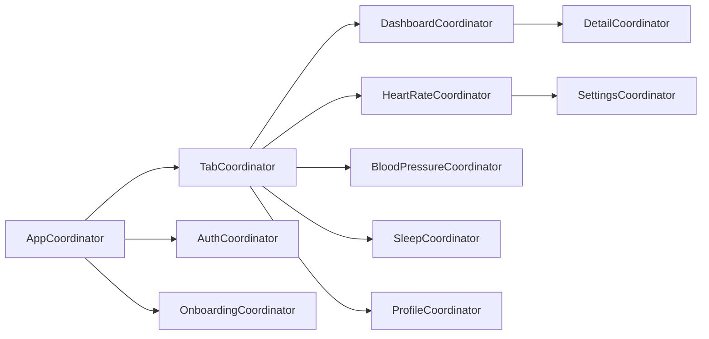
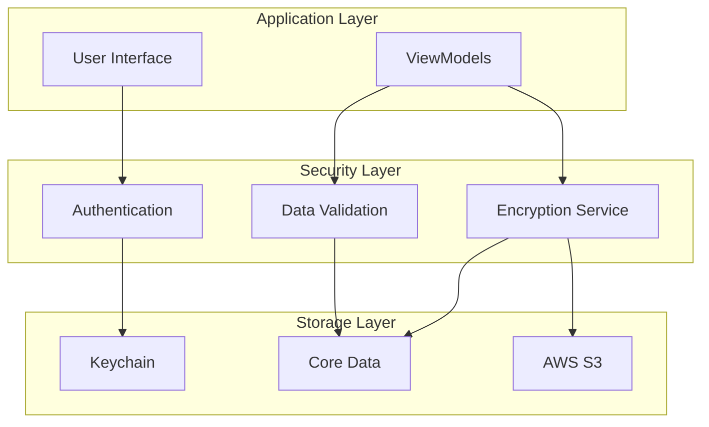

# Architecture Guide

This document provides a comprehensive overview of PadnetXpress's architecture, design patterns, and component structure.

## 📋 Table of Contents

- [Overview](#overview)
- [Architecture Pattern](#architecture-pattern)
- [App Structure](#app-structure)
- [Data Flow](#data-flow)
- [Component Hierarchy](#component-hierarchy)
- [Navigation](#navigation)
- [Dependency Management](#dependency-management)
- [Security Architecture](#security-architecture)

## 🏗️ Overview

PadnetXpress follows a **Model-View-ViewModel (MVVM)** architectural pattern combined with **Repository Pattern** for data access and **Coordinator Pattern** for navigation. This architecture ensures:

- **Separation of Concerns**: Clear boundaries between UI, business logic, and data layers
- **Testability**: Isolated components that can be easily unit tested
- **Maintainability**: Modular structure for easy maintenance and updates
- **Scalability**: Architecture supports growing feature sets

## 🎯 Architecture Pattern

### MVVM + Repository + Coordinator



### Layer Responsibilities

| Layer | Responsibility | Components |
|-------|---------------|------------|
| **View** | UI presentation, user interaction | SwiftUI Views, Components |
| **ViewModel** | Business logic, state management | ObservableObject classes |
| **Model** | Data structures, business entities | Structs, Enums |
| **Repository** | Data access abstraction | Protocol-based repositories |
| **Services** | External integrations | Network, Storage, HealthKit |
| **Coordinator** | Navigation management | Screen coordination |

## 📱 App Structure

### Core Architecture Diagram



### Directory Structure

```
PadnetXpress/
├── 📱 Screens/                    # SwiftUI Views
│   ├── Dashboard/
│   ├── HeartRate/
│   ├── BloodPressure/
│   ├── Sleep/
│   └── Profile/
├── 🧩 Component/                  # Reusable UI Components
│   ├── Charts/
│   ├── Buttons/
│   ├── Cards/
│   └── Common/
├── 🧠 ViewModel/                  # Business Logic
│   ├── DashboardViewModel.swift
│   ├── HeartRateViewModel.swift
│   ├── BloodPressureViewModel.swift
│   └── SleepViewModel.swift
├── 📊 Model/                      # Data Models
│   ├── HealthData.swift
│   ├── User.swift
│   └── Analytics.swift
├── 🗄️ Repositories/              # Data Access Layer
│   ├── HealthRepository.swift
│   ├── UserRepository.swift
│   └── AnalyticsRepository.swift
├── 🌐 Networking/                 # API Layer
│   ├── APIClient.swift
│   ├── Endpoints.swift
│   └── NetworkModels/
├── 💾 Storage/                    # Local Storage
│   ├── CoreDataStack.swift
│   ├── KeychainManager.swift
│   └── UserDefaults+Extensions.swift
├── 🔒 Encryption/                 # Security
│   ├── EncryptionManager.swift
│   └── CryptoUtils.swift
├── 📡 SignalQuality/              # Health Data Processing
│   ├── SignalProcessor.swift
│   └── DataValidator.swift
├── 🔬 Butterworth/                # Signal Filtering
│   ├── ButterworthFilter.swift
│   └── FilterConfig.swift
├── 🩺 RedPark/                    # Medical Device Integration
│   ├── DeviceManager.swift
│   └── BluetoothService.swift
├── 📋 Protobuf/                   # Data Serialization
│   └── Generated/
├── 🔗 DeepLinking/                # URL Handling
│   ├── DeepLinkCoordinator.swift
│   └── URLRouter.swift
├── 🛠️ Utils/                      # Utilities
│   ├── Constants.swift
│   ├── Helpers.swift
│   └── Logger.swift
└── ➕ Extensions/                 # Swift Extensions
    ├── View+Extensions.swift
    ├── Color+Extensions.swift
    └── Date+Extensions.swift
```

## 🔄 Data Flow

### Health Data Flow



### Authentication Flow



## 🧩 Component Hierarchy

### Main Components



### Reusable Components

| Component | Purpose | Usage |
|-----------|---------|-------|
| `HealthChart` | Data visualization | Heart rate, BP, sleep trends |
| `MetricCard` | Display health metrics | Dashboard summaries |
| `ActionButton` | Primary actions | Start/stop monitoring |
| `InputField` | Data entry | Manual BP entry |
| `LoadingView` | Loading states | Data fetch operations |
| `ErrorView` | Error display | Network/data errors |
| `EmptyStateView` | No data states | Empty lists/charts |

## 🧭 Navigation

### Navigation Architecture



### Deep Linking

PadnetXpress supports deep linking for:

- Direct feature access: `padnetxpress://heart-rate`
- Specific data views: `padnetxpress://sleep/analysis`
- Settings screens: `padnetxpress://settings/profile`

### URL Scheme Structure

```
padnetxpress://[module]/[action]?[parameters]

Examples:
- padnetxpress://dashboard
- padnetxpress://heart-rate/monitor
- padnetxpress://blood-pressure/add
- padnetxpress://sleep/analysis?date=2024-01-15
```

## 📦 Dependency Management

### Dependency Injection

```swift
// Protocol-based dependency injection
protocol HealthRepositoryProtocol {
    func getHeartRateData() -> AnyPublisher<[HeartRateReading], Error>
    func startMonitoring() -> AnyPublisher<Void, Error>
}

class HeartRateViewModel: ObservableObject {
    private let healthRepository: HealthRepositoryProtocol
    
    init(healthRepository: HealthRepositoryProtocol = HealthRepository()) {
        self.healthRepository = healthRepository
    }
}
```

### Service Container

```swift
class ServiceContainer {
    static let shared = ServiceContainer()
    
    lazy var healthRepository: HealthRepositoryProtocol = HealthRepository()
    lazy var networkService: NetworkServiceProtocol = NetworkService()
    lazy var storageService: StorageServiceProtocol = StorageService()
}
```

## 🔒 Security Architecture

### Data Security Layers



### Security Principles

1. **Data Encryption**: AES-256 encryption for sensitive health data
2. **Secure Storage**: Keychain for credentials, encrypted Core Data
3. **Network Security**: Certificate pinning, TLS 1.3
4. **Access Control**: Biometric authentication, session management
5. **Data Minimization**: Only collect necessary health data
6. **Audit Trail**: Comprehensive logging for security events

### Encryption Implementation

```swift
class EncryptionService {
    private let keyManager: KeyManager
    
    func encrypt<T: Codable>(_ data: T) throws -> Data {
        let jsonData = try JSONEncoder().encode(data)
        return try AES.GCM.seal(jsonData, using: keyManager.dataKey)
    }
    
    func decrypt<T: Codable>(_ encryptedData: Data, as type: T.Type) throws -> T {
        let decryptedData = try AES.GCM.open(encryptedData, using: keyManager.dataKey)
        return try JSONDecoder().decode(type, from: decryptedData)
    }
}
```

## 🧪 Testing Architecture

### Testing Pyramid

```mermaid
pyramid
    title Testing Strategy
    "UI Tests" : 10
    "Integration Tests" : 30
    "Unit Tests" : 60
```

### Test Structure

- **Unit Tests** (60%): ViewModels, Repositories, Services
- **Integration Tests** (30%): API integration, HealthKit integration
- **UI Tests** (10%): Critical user flows, accessibility

### Mock Implementation

```swift
class MockHealthRepository: HealthRepositoryProtocol {
    var shouldReturnError = false
    var mockHeartRateData: [HeartRateReading] = []
    
    func getHeartRateData() -> AnyPublisher<[HeartRateReading], Error> {
        if shouldReturnError {
            return Fail(error: HealthError.dataUnavailable)
                .eraseToAnyPublisher()
        }
        return Just(mockHeartRateData)
            .setFailureType(to: Error.self)
            .eraseToAnyPublisher()
    }
}
```

## 📈 Performance Considerations

### Optimization Strategies

1. **Lazy Loading**: Load data on-demand
2. **Caching**: Intelligent data caching strategies
3. **Background Processing**: Heavy computations on background queues
4. **Memory Management**: Proper resource cleanup
5. **Network Efficiency**: Request batching and compression

### Performance Monitoring

- Firebase Performance Monitoring
- Custom metrics for health data processing
- Memory and CPU usage tracking
- Network request monitoring

## 🚀 Future Architecture Improvements

### Planned Enhancements

1. **Modularization**: Split into feature-based Swift Packages
2. **Reactive Architecture**: Full Combine/SwiftUI integration
3. **AI/ML Integration**: Core ML for health predictions
4. **Multi-platform**: Shared business logic for watchOS/macOS
5. **Microservices**: Backend service decomposition

### Migration Strategy

1. **Phase 1**: Extract core services to Swift Packages
2. **Phase 2**: Implement reactive data flow
3. **Phase 3**: Add AI/ML capabilities
4. **Phase 4**: Multi-platform expansion

---

This architecture provides a solid foundation for PadnetXpress while maintaining flexibility for future enhancements and scale. 