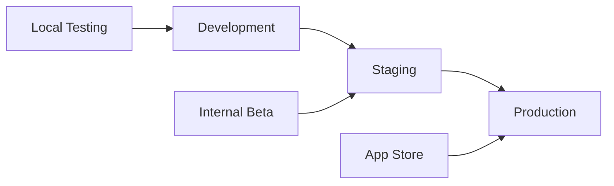
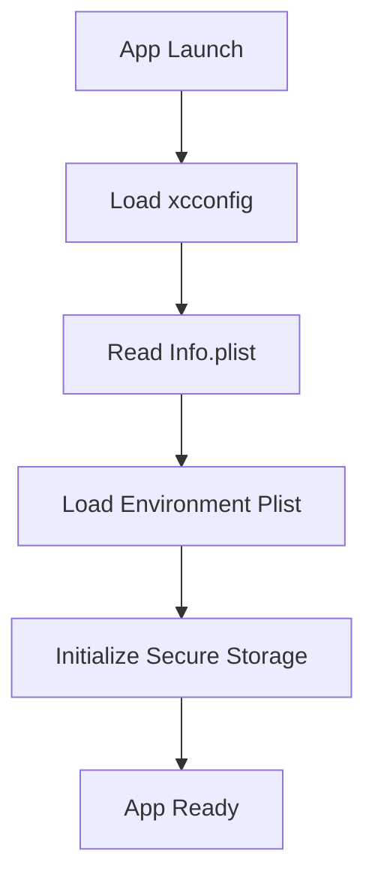

# Environment Configuration Guide

This document provides comprehensive guidance on managing environment variables, secrets, and configuration for PadnetXpress across different deployment environments.

## 📋 Table of Contents

- [Environment Overview](#environment-overview)
- [Configuration Strategy](#configuration-strategy)
- [Environment Variables](#environment-variables)
- [Secrets Management](#secrets-management)
- [Configuration Files](#configuration-files)
- [Runtime Configuration](#runtime-configuration)
- [Security Best Practices](#security-best-practices)
- [Troubleshooting](#troubleshooting)

## 🌍 Environment Overview

PadnetXpress supports multiple environments with different configurations:

| Environment | Purpose | API Endpoint | Features |
|-------------|---------|--------------|----------|
| **Development** | Local development and testing | `dev-api.padnetxpress.com` | Debug features, mock data, verbose logging |
| **Staging** | Pre-production testing | `staging-api.padnetxpress.com` | Production-like environment, internal testing |
| **Production** | Live app store release | `api.padnetxpress.com` | Optimized performance, minimal logging |

### Environment Flow



## 🔧 Configuration Strategy

### Hierarchy of Configuration

1. **Compile-time Configuration** - xcconfig files
2. **Build-time Configuration** - Info.plist settings
3. **Runtime Configuration** - Environment-specific plists
4. **Secure Configuration** - Keychain and encrypted storage

### Configuration Sources



## 📝 Environment Variables

### Core Environment Variables

#### Development Environment
```bash
# API Configuration
API_BASE_URL=https://dev-api.padnetxpress.com
API_TIMEOUT=30
API_RETRY_COUNT=3

# Logging Configuration
LOG_LEVEL=DEBUG
VERBOSE_LOGGING=1
NETWORK_LOGGING=1

# Feature Flags
MOCK_DATA_ENABLED=1
HEALTHKIT_SIMULATION=1
CRASH_REPORTING_ENABLED=0
ANALYTICS_ENABLED=0

# Security
SSL_PINNING_ENABLED=0
ENCRYPTION_LEVEL=STANDARD

# Development Tools
FLIPPER_ENABLED=1
DEBUG_MENU_ENABLED=1
PERFORMANCE_MONITORING=1
```

#### Staging Environment
```bash
# API Configuration
API_BASE_URL=https://staging-api.padnetxpress.com
API_TIMEOUT=20
API_RETRY_COUNT=2

# Logging Configuration
LOG_LEVEL=INFO
VERBOSE_LOGGING=0
NETWORK_LOGGING=1

# Feature Flags
MOCK_DATA_ENABLED=0
HEALTHKIT_SIMULATION=0
CRASH_REPORTING_ENABLED=1
ANALYTICS_ENABLED=1

# Security
SSL_PINNING_ENABLED=1
ENCRYPTION_LEVEL=HIGH

# Testing
FLIPPER_ENABLED=0
DEBUG_MENU_ENABLED=1
PERFORMANCE_MONITORING=1
```

#### Production Environment
```bash
# API Configuration
API_BASE_URL=https://api.padnetxpress.com
API_TIMEOUT=15
API_RETRY_COUNT=1

# Logging Configuration
LOG_LEVEL=ERROR
VERBOSE_LOGGING=0
NETWORK_LOGGING=0

# Feature Flags
MOCK_DATA_ENABLED=0
HEALTHKIT_SIMULATION=0
CRASH_REPORTING_ENABLED=1
ANALYTICS_ENABLED=1

# Security
SSL_PINNING_ENABLED=1
ENCRYPTION_LEVEL=MAXIMUM

# Production Optimizations
FLIPPER_ENABLED=0
DEBUG_MENU_ENABLED=0
PERFORMANCE_MONITORING=1
```

## 🔐 Secrets Management

### Keychain Integration

PadnetXpress uses iOS Keychain for secure storage of sensitive data:

```swift
// KeychainManager.swift
import KeychainSwift

class KeychainManager {
    private let keychain = KeychainSwift()
    
    // API Keys
    private let apiKeyIdentifier = "api_key"
    private let refreshTokenIdentifier = "refresh_token"
    
    // Encryption Keys
    private let encryptionKeyIdentifier = "encryption_key"
    
    func storeAPIKey(_ key: String) {
        keychain.set(key, forKey: apiKeyIdentifier)
    }
    
    func getAPIKey() -> String? {
        return keychain.get(apiKeyIdentifier)
    }
    
    func storeEncryptionKey(_ key: Data) {
        keychain.set(key, forKey: encryptionKeyIdentifier)
    }
    
    func getEncryptionKey() -> Data? {
        return keychain.getData(encryptionKeyIdentifier)
    }
    
    func clearAllSecrets() {
        keychain.clear()
    }
}
```

### Environment-Specific Secrets

#### Development Secrets
```swift
// Development.plist
<?xml version="1.0" encoding="UTF-8"?>
<dict>
    <key>APIKey</key>
    <string>dev_api_key_placeholder</string>
    <key>AWSAccessKey</key>
    <string>dev_aws_key_placeholder</string>
    <key>FirebaseConfig</key>
    <string>GoogleService-Info-Dev.plist</string>
</dict>
```

#### Production Secrets
```swift
// Production.plist (encrypted)
<?xml version="1.0" encoding="UTF-8"?>
<dict>
    <key>APIKey</key>
    <string>${API_KEY}</string>
    <key>AWSAccessKey</key>
    <string>${AWS_ACCESS_KEY}</string>
    <key>FirebaseConfig</key>
    <string>GoogleService-Info-Prod.plist</string>
</dict>
```

## 📄 Configuration Files

### xcconfig Files

#### Shared.xcconfig
```bash
// Shared configuration for all environments
// Path: Configurations/Shared.xcconfig

// Build Settings
IPHONEOS_DEPLOYMENT_TARGET = 15.0
SWIFT_VERSION = 5.5
ENABLE_BITCODE = NO
CLANG_ENABLE_MODULES = YES

// App Configuration
PRODUCT_NAME = PadnetXpress
MARKETING_VERSION = 1.0.0
CURRENT_PROJECT_VERSION = 1

// Capabilities
HEALTH_KIT_ENABLED = YES
BACKGROUND_MODES_ENABLED = YES
KEYCHAIN_ACCESS_GROUPS = $(AppIdentifierPrefix)com.padnetxpress.keychain

// Code Signing
CODE_SIGN_STYLE = Manual
DEVELOPMENT_TEAM = YOUR_TEAM_ID
```

#### Development.xcconfig
```bash
// Development environment configuration
// Path: Configurations/Development.xcconfig

#include "Shared.xcconfig"

// Bundle Configuration
PRODUCT_BUNDLE_IDENTIFIER = com.padnetxpress.app.dev
PRODUCT_NAME = PadnetXpress Dev

// API Configuration
API_BASE_URL = https://dev-api.padnetxpress.com
API_TIMEOUT = 30
API_RETRY_COUNT = 3

// Logging
LOG_LEVEL = DEBUG
VERBOSE_LOGGING = 1

// Features
MOCK_DATA_ENABLED = 1
HEALTHKIT_SIMULATION = 1
DEBUG_MENU_ENABLED = 1

// Security
SSL_PINNING_ENABLED = 0
ENCRYPTION_LEVEL = STANDARD

// Code Signing
CODE_SIGN_IDENTITY = iPhone Developer
PROVISIONING_PROFILE_SPECIFIER = PadnetXpress Development
```

#### Staging.xcconfig
```bash
// Staging environment configuration
// Path: Configurations/Staging.xcconfig

#include "Shared.xcconfig"

// Bundle Configuration
PRODUCT_BUNDLE_IDENTIFIER = com.padnetxpress.app.staging
PRODUCT_NAME = PadnetXpress Staging

// API Configuration
API_BASE_URL = https://staging-api.padnetxpress.com
API_TIMEOUT = 20
API_RETRY_COUNT = 2

// Logging
LOG_LEVEL = INFO
VERBOSE_LOGGING = 0

// Features
MOCK_DATA_ENABLED = 0
HEALTHKIT_SIMULATION = 0
DEBUG_MENU_ENABLED = 1

// Security
SSL_PINNING_ENABLED = 1
ENCRYPTION_LEVEL = HIGH

// Code Signing
CODE_SIGN_IDENTITY = iPhone Distribution
PROVISIONING_PROFILE_SPECIFIER = PadnetXpress Staging
```

#### Production.xcconfig
```bash
// Production environment configuration
// Path: Configurations/Production.xcconfig

#include "Shared.xcconfig"

// Bundle Configuration
PRODUCT_BUNDLE_IDENTIFIER = com.padnetxpress.app
PRODUCT_NAME = PadnetXpress

// API Configuration
API_BASE_URL = https://api.padnetxpress.com
API_TIMEOUT = 15
API_RETRY_COUNT = 1

// Logging
LOG_LEVEL = ERROR
VERBOSE_LOGGING = 0

// Features
MOCK_DATA_ENABLED = 0
HEALTHKIT_SIMULATION = 0
DEBUG_MENU_ENABLED = 0

// Security
SSL_PINNING_ENABLED = 1
ENCRYPTION_LEVEL = MAXIMUM

// Code Signing
CODE_SIGN_IDENTITY = iPhone Distribution
PROVISIONING_PROFILE_SPECIFIER = PadnetXpress Distribution
```

### Info.plist Configuration

#### Environment-aware Info.plist
```xml
<?xml version="1.0" encoding="UTF-8"?>
<plist version="1.0">
<dict>
    <!-- App Identity -->
    <key>CFBundleDisplayName</key>
    <string>$(PRODUCT_NAME)</string>
    
    <key>CFBundleIdentifier</key>
    <string>$(PRODUCT_BUNDLE_IDENTIFIER)</string>
    
    <key>CFBundleVersion</key>
    <string>$(CURRENT_PROJECT_VERSION)</string>
    
    <key>CFBundleShortVersionString</key>
    <string>$(MARKETING_VERSION)</string>
    
    <!-- API Configuration -->
    <key>APIBaseURL</key>
    <string>$(API_BASE_URL)</string>
    
    <key>APITimeout</key>
    <string>$(API_TIMEOUT)</string>
    
    <key>APIRetryCount</key>
    <string>$(API_RETRY_COUNT)</string>
    
    <!-- Logging Configuration -->
    <key>LogLevel</key>
    <string>$(LOG_LEVEL)</string>
    
    <key>VerboseLogging</key>
    <string>$(VERBOSE_LOGGING)</string>
    
    <!-- Feature Flags -->
    <key>MockDataEnabled</key>
    <string>$(MOCK_DATA_ENABLED)</string>
    
    <key>HealthKitSimulation</key>
    <string>$(HEALTHKIT_SIMULATION)</string>
    
    <key>DebugMenuEnabled</key>
    <string>$(DEBUG_MENU_ENABLED)</string>
    
    <!-- Security Configuration -->
    <key>SSLPinningEnabled</key>
    <string>$(SSL_PINNING_ENABLED)</string>
    
    <key>EncryptionLevel</key>
    <string>$(ENCRYPTION_LEVEL)</string>
    
    <!-- HealthKit Configuration -->
    <key>NSHealthShareUsageDescription</key>
    <string>PadnetXpress needs access to read your health data to provide comprehensive health monitoring and insights.</string>
    
    <key>NSHealthUpdateUsageDescription</key>
    <string>PadnetXpress needs to write health data to keep your Apple Health app synchronized with your measurements.</string>
    
    <!-- Background Modes -->
    <key>UIBackgroundModes</key>
    <array>
        <string>background-processing</string>
        <string>health-kit</string>
    </array>
    
    <!-- App Transport Security -->
    <key>NSAppTransportSecurity</key>
    <dict>
        <key>NSAllowsArbitraryLoads</key>
        <false/>
        <key>NSExceptionDomains</key>
        <dict>
            <key>api.padnetxpress.com</key>
            <dict>
                <key>NSExceptionRequiresForwardSecrecy</key>
                <false/>
                <key>NSExceptionMinimumTLSVersion</key>
                <string>TLSv1.2</string>
            </dict>
        </dict>
    </dict>
</dict>
</plist>
```

## 🚀 Runtime Configuration

### Configuration Manager

```swift
// ConfigurationManager.swift
import Foundation

enum Environment {
    case development
    case staging
    case production
    
    static var current: Environment {
        #if DEBUG
        return .development
        #elseif STAGING
        return .staging
        #else
        return .production
        #endif
    }
}

class ConfigurationManager {
    static let shared = ConfigurationManager()
    
    private let bundle = Bundle.main
    private let keychain = KeychainManager()
    
    // MARK: - API Configuration
    var apiBaseURL: String {
        return bundle.object(forInfoDictionaryKey: "APIBaseURL") as? String ?? ""
    }
    
    var apiTimeout: TimeInterval {
        let timeoutString = bundle.object(forInfoDictionaryKey: "APITimeout") as? String ?? "15"
        return Double(timeoutString) ?? 15.0
    }
    
    var apiRetryCount: Int {
        let retryString = bundle.object(forInfoDictionaryKey: "APIRetryCount") as? String ?? "1"
        return Int(retryString) ?? 1
    }
    
    // MARK: - Logging Configuration
    var logLevel: LogLevel {
        let levelString = bundle.object(forInfoDictionaryKey: "LogLevel") as? String ?? "ERROR"
        return LogLevel(rawValue: levelString) ?? .error
    }
    
    var verboseLoggingEnabled: Bool {
        let verboseString = bundle.object(forInfoDictionaryKey: "VerboseLogging") as? String ?? "0"
        return verboseString == "1"
    }
    
    // MARK: - Feature Flags
    var mockDataEnabled: Bool {
        let mockString = bundle.object(forInfoDictionaryKey: "MockDataEnabled") as? String ?? "0"
        return mockString == "1"
    }
    
    var healthKitSimulationEnabled: Bool {
        let simString = bundle.object(forInfoDictionaryKey: "HealthKitSimulation") as? String ?? "0"
        return simString == "1"
    }
    
    var debugMenuEnabled: Bool {
        let debugString = bundle.object(forInfoDictionaryKey: "DebugMenuEnabled") as? String ?? "0"
        return debugString == "1"
    }
    
    // MARK: - Security Configuration
    var sslPinningEnabled: Bool {
        let pinningString = bundle.object(forInfoDictionaryKey: "SSLPinningEnabled") as? String ?? "1"
        return pinningString == "1"
    }
    
    var encryptionLevel: EncryptionLevel {
        let levelString = bundle.object(forInfoDictionaryKey: "EncryptionLevel") as? String ?? "MAXIMUM"
        return EncryptionLevel(rawValue: levelString) ?? .maximum
    }
    
    // MARK: - Secure Configuration
    var apiKey: String? {
        return keychain.getAPIKey()
    }
    
    var encryptionKey: Data? {
        return keychain.getEncryptionKey()
    }
    
    // MARK: - Environment Detection
    var isDebugMode: Bool {
        return Environment.current == .development
    }
    
    var isStagingMode: Bool {
        return Environment.current == .staging
    }
    
    var isProductionMode: Bool {
        return Environment.current == .production
    }
}

// MARK: - Supporting Types
enum LogLevel: String, CaseIterable {
    case debug = "DEBUG"
    case info = "INFO"
    case warning = "WARNING"
    case error = "ERROR"
}

enum EncryptionLevel: String, CaseIterable {
    case standard = "STANDARD"
    case high = "HIGH"
    case maximum = "MAXIMUM"
}
```

### Environment-Specific Plists

#### Development.plist
```xml
<?xml version="1.0" encoding="UTF-8"?>
<plist version="1.0">
<dict>
    <key>FirebaseConfig</key>
    <string>GoogleService-Info-Dev</string>
    
    <key>AWSRegion</key>
    <string>us-east-1</string>
    
    <key>AWSBucket</key>
    <string>padnetxpress-dev-data</string>
    
    <key>TestUserCredentials</key>
    <dict>
        <key>email</key>
        <string>test@padnetxpress.com</string>
        <key>password</key>
        <string>TestPassword123!</string>
    </dict>
    
    <key>MockDataSets</key>
    <array>
        <string>heart_rate_sample</string>
        <string>blood_pressure_sample</string>
        <string>sleep_data_sample</string>
    </array>
</dict>
</plist>
```

#### Production.plist
```xml
<?xml version="1.0" encoding="UTF-8"?>
<plist version="1.0">
<dict>
    <key>FirebaseConfig</key>
    <string>GoogleService-Info</string>
    
    <key>AWSRegion</key>
    <string>us-west-2</string>
    
    <key>AWSBucket</key>
    <string>padnetxpress-prod-data</string>
    
    <key>SupportContact</key>
    <dict>
        <key>email</key>
        <string>support@padnetxpress.com</string>
        <key>phone</key>
        <string>+1-555-0123</string>
    </dict>
    
    <key>EmergencyContacts</key>
    <array>
        <dict>
            <key>name</key>
            <string>Emergency Support</string>
            <key>phone</key>
            <string>+1-555-HELP</string>
        </dict>
    </array>
</dict>
</plist>
```

## 🔒 Security Best Practices

### Secrets Protection

1. **Never commit secrets to version control**
   ```bash
   # .gitignore
   *.plist
   Configurations/Production.xcconfig
   fastlane/.env
   GoogleService-Info*.plist
   ```

2. **Use environment variables for CI/CD**
   ```bash
   # GitHub Actions secrets
   API_KEY_PRODUCTION
   AWS_ACCESS_KEY_ID
   AWS_SECRET_ACCESS_KEY
   FIREBASE_CONFIG_PRODUCTION
   ```

3. **Encrypt sensitive configuration files**
   ```bash
   # Use tools like git-crypt or BlackBox
   git-crypt add-gpg-user USER_EMAIL
   git-crypt add Production.plist
   ```

### Runtime Security

```swift
// SecurityManager.swift
class SecurityManager {
    static let shared = SecurityManager()
    
    func validateEnvironment() {
        guard !isJailbroken() else {
            fatalError("App cannot run on jailbroken devices")
        }
        
        guard !isDebugging() else {
            if ConfigurationManager.shared.isProductionMode {
                fatalError("Debugging not allowed in production")
            }
        }
        
        validateCertificatePinning()
    }
    
    private func isJailbroken() -> Bool {
        // Jailbreak detection logic
        let jailbreakPaths = [
            "/Applications/Cydia.app",
            "/private/var/lib/apt/",
            "/private/var/lib/cydia",
            "/private/var/stash"
        ]
        
        return jailbreakPaths.contains { FileManager.default.fileExists(atPath: $0) }
    }
    
    private func isDebugging() -> Bool {
        // Debugger detection
        var info = kinfo_proc()
        var mib: [Int32] = [CTL_KERN, KERN_PROC, KERN_PROC_PID, getpid()]
        var size = MemoryLayout<kinfo_proc>.stride
        
        let junk = sysctl(&mib, UInt32(mib.count), &info, &size, nil, 0)
        assert(junk == 0, "sysctl failed")
        
        return (info.kp_proc.p_flag & P_TRACED) != 0
    }
    
    private func validateCertificatePinning() {
        if ConfigurationManager.shared.sslPinningEnabled {
            // Initialize certificate pinning
            CertificatePinner.shared.initialize()
        }
    }
}
```

## 🔧 Build Integration

### Xcode Build Phases

#### Pre-build Script
```bash
#!/bin/bash
# Pre-build configuration script

echo "🔧 Setting up environment for ${CONFIGURATION}"

# Copy environment-specific files
if [ "${CONFIGURATION}" = "Debug" ]; then
    cp "${SRCROOT}/Configurations/Development.plist" "${BUILT_PRODUCTS_DIR}/${PRODUCT_NAME}.app/Environment.plist"
elif [ "${CONFIGURATION}" = "Staging" ]; then
    cp "${SRCROOT}/Configurations/Staging.plist" "${BUILT_PRODUCTS_DIR}/${PRODUCT_NAME}.app/Environment.plist"
elif [ "${CONFIGURATION}" = "Release" ]; then
    cp "${SRCROOT}/Configurations/Production.plist" "${BUILT_PRODUCTS_DIR}/${PRODUCT_NAME}.app/Environment.plist"
fi

# Copy Firebase configuration
FIREBASE_CONFIG="${FIREBASE_CONFIG_FILE:-GoogleService-Info}"
cp "${SRCROOT}/${FIREBASE_CONFIG}.plist" "${BUILT_PRODUCTS_DIR}/${PRODUCT_NAME}.app/GoogleService-Info.plist"

echo "✅ Environment setup complete"
```

#### Post-build Script
```bash
#!/bin/bash
# Post-build cleanup script

echo "🧹 Cleaning up sensitive files"

# Remove development files from production builds
if [ "${CONFIGURATION}" = "Release" ]; then
    rm -f "${BUILT_PRODUCTS_DIR}/${PRODUCT_NAME}.app/Development.plist"
    rm -f "${BUILT_PRODUCTS_DIR}/${PRODUCT_NAME}.app/Staging.plist"
fi

echo "✅ Cleanup complete"
```

### CocoaPods Integration

```ruby
# Podfile
post_install do |installer|
  installer.pods_project.targets.each do |target|
    target.build_configurations.each do |config|
      # Apply environment-specific settings
      if config.name == 'Debug'
        config.build_settings['GCC_PREPROCESSOR_DEFINITIONS'] ||= ['$(inherited)']
        config.build_settings['GCC_PREPROCESSOR_DEFINITIONS'] << 'DEBUG=1'
      end
      
      if config.name == 'Staging'
        config.build_settings['GCC_PREPROCESSOR_DEFINITIONS'] ||= ['$(inherited)']
        config.build_settings['GCC_PREPROCESSOR_DEFINITIONS'] << 'STAGING=1'
      end
    end
  end
end
```

## 🐛 Troubleshooting

### Common Configuration Issues

#### 1. xcconfig Not Loading
```bash
# Verify xcconfig is set in project settings
# Project → Info → Configurations
# Ensure correct xcconfig file is selected for each configuration
```

#### 2. Environment Variables Not Resolving
```bash
# Check Info.plist syntax
# Ensure $(VARIABLE_NAME) format is used
# Verify variable is defined in xcconfig
```

#### 3. Keychain Access Issues
```swift
// Check keychain access groups
// Verify entitlements are properly configured
// Ensure app group is included in provisioning profile
```

#### 4. Firebase Configuration
```bash
# Ensure correct GoogleService-Info.plist is copied
# Verify Bundle ID matches Firebase project
# Check Firebase configuration in code
```

### Debug Configuration

```swift
// ConfigurationDebugger.swift
#if DEBUG
class ConfigurationDebugger {
    static func printCurrentConfiguration() {
        let config = ConfigurationManager.shared
        
        print("=== Current Configuration ===")
        print("Environment: \(Environment.current)")
        print("API Base URL: \(config.apiBaseURL)")
        print("Log Level: \(config.logLevel)")
        print("Mock Data: \(config.mockDataEnabled)")
        print("SSL Pinning: \(config.sslPinningEnabled)")
        print("Debug Menu: \(config.debugMenuEnabled)")
        print("============================")
    }
}
#endif
```

### Environment Validation

```swift
// EnvironmentValidator.swift
class EnvironmentValidator {
    static func validateConfiguration() throws {
        let config = ConfigurationManager.shared
        
        // Validate API URL
        guard !config.apiBaseURL.isEmpty else {
            throw ConfigurationError.missingAPIURL
        }
        
        guard URL(string: config.apiBaseURL) != nil else {
            throw ConfigurationError.invalidAPIURL
        }
        
        // Validate security settings
        if config.isProductionMode {
            guard config.sslPinningEnabled else {
                throw ConfigurationError.sslPinningRequired
            }
            
            guard config.encryptionLevel == .maximum else {
                throw ConfigurationError.insufficientEncryption
            }
        }
        
        // Validate secrets
        guard config.apiKey != nil else {
            throw ConfigurationError.missingAPIKey
        }
    }
}

enum ConfigurationError: Error {
    case missingAPIURL
    case invalidAPIURL
    case sslPinningRequired
    case insufficientEncryption
    case missingAPIKey
}
```

---

For environment configuration support, contact: devops@padnetxpress.com 